<p align="center">
  
</p>

## Overview

Animated Medical Imaging (AMI) is a software-based solution to streamline the process of generating an optimal subset 
representing a multi-dimensional medical image and combining the subset to an animated sequence.

Supported file formats:
* Analyze (.hdr, .img)
* MetaImage (.mha, .mhd, .raw)
* Multi-frame DICOM (.dcm)
* Nifti (.nii)

### Examples

The first example [[1]](#ref1) is part of the BRATS 2015: Brain Tumor Image Segmentation Challenge dataset hosted on the SMIR platform [[3]](#ref3).
It has been generated with the following command:

```
AMI.Portable.exe --SourcePath SMIR.Brain.XX.O.MR_Flair.36620.mha --DestinationPath temp
```

<p align="center">
  
</p>

<p align="center">
  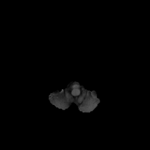
  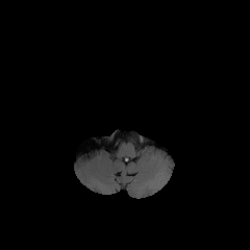
  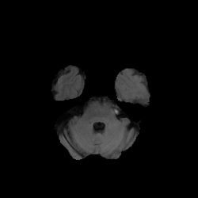
  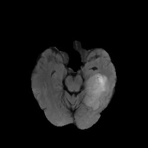
  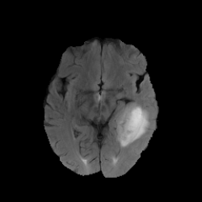
</p>

<p align="center">
  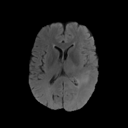
  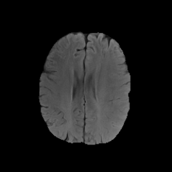
  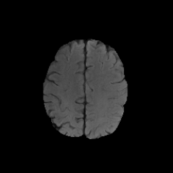
  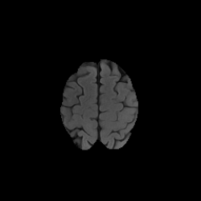
  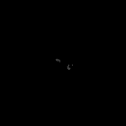
</p>

The second example [[2]](#ref2) is part of the ISLES 2018: Ischemic Stroke Lesion Segmentation Challenge dataset hosted on the SMIR platform [[3]](#ref3).
It has been generated with the following command:

```
AMI.Portable.exe --SourcePath SMIR.Brain.XX.O.CT.346124.nii --DestinationPath temp
```

<p align="center">
  
</p>

<p align="center">
  
  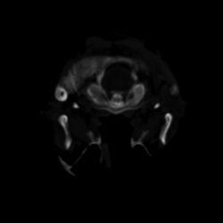
  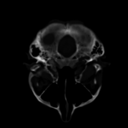
  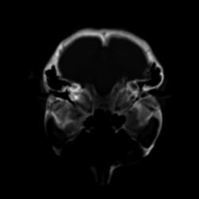
  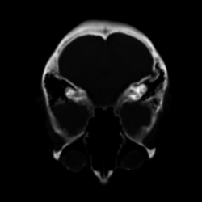
</p>

<p align="center">
  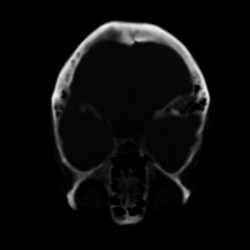
  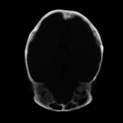
  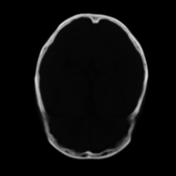
  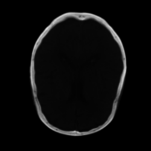
  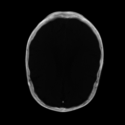
</p>

[1]<a name="ref1"></a> [SMIR.Brain.XX.O.MR_Flair.36620.mha: BRATS 2015 - Training - HGG - tcia_pat499_0001](https://www.smir.ch/objects/36620)

[2]<a name="ref2"></a> [SMIR.Brain.XX.O.CT.346124.nii: ISLES 2018 - Training - Train_52_A](https://www.smir.ch/objects/346124)

[3]<a name="ref3"></a> [SICAS Medical Image Repository](https://www.smir.ch/) 

### Installation

Easiest is to obtain the latest AMI.Portable executable from [GitHub](https://github.com/niklr/animated-medical-imaging/releases). 
This compressed archive contains the exectuable, required third-party binaries and configuration files.

Other dependencies:
* [Microsoft .NET Framework 4.6.1](https://www.microsoft.com/en-us/download/details.aspx?id=49982)

### Usage

```
AMI.Portable.exe --help
```

* `--DesiredSize` The size of the output images in pixels. (Default is 250)
* `--AmountPerAxis` The amount of images to be extracted per axis. (Default is 10)
* `--SourcePath` The path of the source image.
* `--DestinationPath` The path of the destination where the output should be written.
* `--Grayscale` Whether the images should be converted to grayscale. (Default is 1)
* `--OpenCombinedGif` Whether the combined gif should be opened after creation. (Default is 0)
* `--help` Display this help screen.
* `--version` Display version information.

### Configuration

logging.json

```json
{
  "Logging": {
    "LogLevel": {
      "Default": "Debug",
      "System": "Information",
      "Microsoft": "Information"
    },
    "Console": {
      "IncludeScopes": "true"
    }
  }
}
```

The `Logging` property can have `LogLevel` and log provider properties (Console is shown).

The `LogLevel` property under `Logging` specifies the minimum level to log for selected categories. 
In the example, `System` and `Microsoft` categories log at `Information` level, and all others log at `Debug` level.

Other properties under `Logging` specify logging providers. The example is for the `Console` provider. 
If a provider supports log scopes, `IncludeScopes` indicates whether they're enabled. 
A provider property (such as `Console` in the example) may also specify a `LogLevel` property. 
`LogLevel` under a provider specifies levels to log for that provider.

### Output

ExtractOutput

* `version (string)` The version number of the application.
* `labelCount (number)` The amount of labels in the image.
* `images (array of PositionAxisContainer)` A list of extracted images.
* `gifs (array of AxisContainer)` A list of created GIFs.
* `combinedGif (string)` The filename of the combined GIF (contains all requested axis types).

PositionAxisContainer

* `position (number)` The position of the extracted image on the respective axis.
* `axisType (string / enum)` The respective axis of the coordinate system.
* `entity (string)` The filename of the extracted image.

AxisContainer

* `axisType (string / enum)` The respective axis of the coordinate system.
* `entity (string)` The filename of the extracted image.

AxisType (enum)

* `x` The x-axis of the coordinate system.
* `y` The y-axis of the coordinate system.
* `z` The z-axis of the coordinate system.

### Build

The build process makes use of cake (C# make) a cross-platform build automation system with a C# DSL for tasks such as compiling code, copying files and folders, 
running unit tests, compressing files and building NuGet packages.

Open up a Powershell prompt and execute the bootstrapper script for the respective platform:

#### x64 (win64)

```
PS> .\build.ps1 -ScriptArgs '-platformArg="x64"'
```

Builds the solution into: 
* src\AMI.Portable\bin\x64\Release

#### x86 (win32)

```
PS> .\build.ps1 -ScriptArgs '-platformArg="x86"'
```

Builds the solution into: 
* src\AMI.Portable\bin\x86\Release